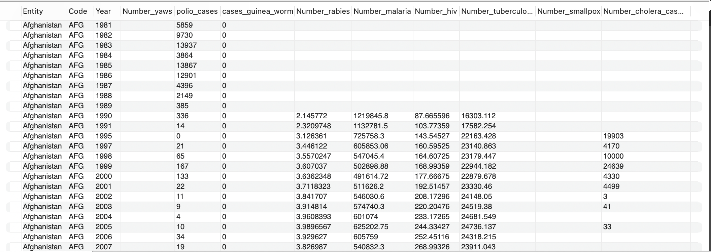
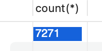
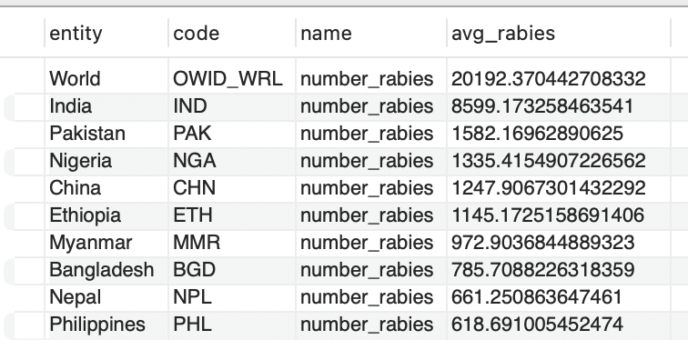
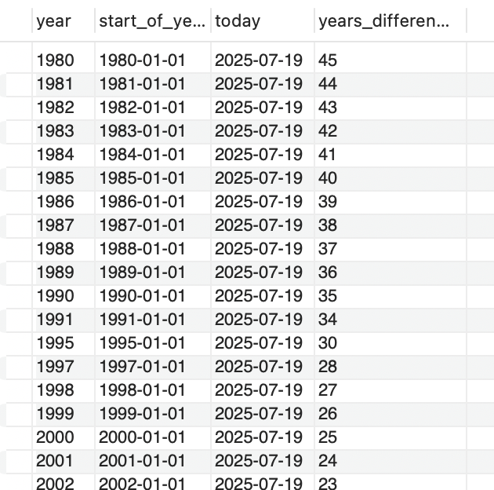
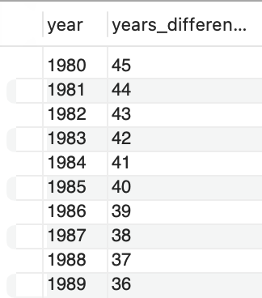

# Фінальний проєкт з дисципліни Relational Databases: Concepts and Techniques!

1. Завантажте дані:

- Створіть схему pandemic у базі даних за допомогою `SQL`-команди.
```MySQL
CREATE SCHEMA pandemic;
```

- Оберіть її як схему за замовчуванням за допомогою `SQL`-команди.

```MySQL
USE pandemic;
```

- Імпортуйте дані за допомогою `Import wizard` так, як ви вже робили це у темі 3.
- Продивіться дані, щоб бути у контексті.
```MySQL
SHOW CREATE TABLE infectious_cases;

CREATE TABLE `infectious_cases` (
    `Entity` text,
    `Code` text,
    `Year` int DEFAULT NULL,
    `Number_yaws` text,
    `polio_cases` int DEFAULT NULL,
    `cases_guinea_worm` int DEFAULT NULL,
    `Number_rabies` text,
    `Number_malaria` text,
    `Number_hiv` text,
    `Number_tuberculosis` text,
    `Number_smallpox` text,
    `Number_cholera_cases` text
) ENGINE=InnoDB DEFAULT CHARSET=utf8mb4 COLLATE=utf8mb4_0900_ai_ci

SELECT * FROM infectious_cases;
```

[1.check_data.csv](1.check_data.csv)

<a href="1.check_data.png">
  
</a>

- Виконайте запит `SELECT COUNT(*) FROM infectious_cases` , щоб ментор міг зрозуміти, скільки записів ви завантажили у базу даних із файла.
```MySQL
SELECT count(*) FROM infectious_cases;

7271
```
<a href="2.count.png">
  
</a>

2. Нормалізуйте таблицю `infectious_cases` до 3ї нормальної форми. Збережіть у цій же схемі дві таблиці з нормалізованими даними.

```MySQL
# Таблиця країн
CREATE TABLE countries (
    id INT AUTO_INCREMENT PRIMARY KEY,
    entity VARCHAR(100) NOT NULL,
    code VARCHAR(100),
    UNIQUE(entity, code)
);

# Таблиця хвороб
CREATE TABLE diseases (
    id INT AUTO_INCREMENT PRIMARY KEY,
    name VARCHAR(100) NOT NULL UNIQUE
);

# Таблиця зв’язку
CREATE TABLE cases (
    id INT AUTO_INCREMENT PRIMARY KEY,
    country_id INT NOT NULL,
    disease_id INT NOT NULL,
    year INT NOT NULL,
    case_count FLOAT,
    FOREIGN KEY (country_id) REFERENCES countries(id),
    FOREIGN KEY (disease_id) REFERENCES diseases(id)
);

# Наповнення країн
INSERT INTO countries (entity, code)
	SELECT DISTINCT Entity, Code
	FROM infectious_cases;

# Наповнення хвороб
INSERT INTO diseases (name)
VALUES 
  ('number_yaws'),
  ('polio_cases'),
  ('cases_guinea_worm'),
  ('number_rabies'),
  ('number_malaria'),
  ('number_hiv'),
  ('number_tuberculosis'),
  ('number_smallpox'),
  ('number_cholera_cases');

# Вставка даних у нормалізовану cases
# number_yaws
INSERT INTO cases (country_id, disease_id, year, case_count)
SELECT 
    c.id,
    d.id,
    ic.Year,
    NULLIF(ic.Number_yaws, '') + 0
FROM infectious_cases ic
JOIN countries c ON ic.Entity = c.entity AND ic.Code = c.code
JOIN diseases d ON d.name = 'number_yaws';

# polio_cases
INSERT INTO cases (country_id, disease_id, year, case_count)
SELECT 
    c.id,
    d.id,
    ic.Year,
    ic.polio_cases
FROM infectious_cases ic
JOIN countries c ON ic.Entity = c.entity AND ic.Code = c.code
JOIN diseases d ON d.name = 'polio_cases';

# cases_guinea_worm
INSERT INTO cases (country_id, disease_id, year, case_count)
SELECT 
    c.id,
    d.id,
    ic.Year,
    ic.cases_guinea_worm
FROM infectious_cases ic
JOIN countries c ON ic.Entity = c.entity AND ic.Code = c.code
JOIN diseases d ON d.name = 'cases_guinea_worm';

# number_rabies
INSERT INTO cases (country_id, disease_id, year, case_count)
SELECT 
    c.id,
    d.id,
    ic.Year,
    NULLIF(ic.Number_rabies, '') + 0
FROM infectious_cases ic
JOIN countries c ON ic.Entity = c.entity AND ic.Code = c.code
JOIN diseases d ON d.name = 'number_rabies';

# number_malaria
INSERT INTO cases (country_id, disease_id, year, case_count)
SELECT 
    c.id,
    d.id,
    ic.Year,
    NULLIF(ic.Number_malaria, '') + 0
FROM infectious_cases ic
JOIN countries c ON ic.Entity = c.entity AND ic.Code = c.code
JOIN diseases d ON d.name = 'number_malaria';

# number_hiv
INSERT INTO cases (country_id, disease_id, year, case_count)
SELECT 
    c.id,
    d.id,
    ic.Year,
    NULLIF(ic.Number_hiv, '') + 0
FROM infectious_cases ic
JOIN countries c ON ic.Entity = c.entity AND ic.Code = c.code
JOIN diseases d ON d.name = 'number_hiv';

# number_tuberculosis
INSERT INTO cases (country_id, disease_id, year, case_count)
SELECT 
    c.id,
    d.id,
    ic.Year,
    NULLIF(ic.Number_tuberculosis, '') + 0
FROM infectious_cases ic
JOIN countries c ON ic.Entity = c.entity AND ic.Code = c.code
JOIN diseases d ON d.name = 'number_tuberculosis';

# number_smallpox
INSERT INTO cases (country_id, disease_id, year, case_count)
SELECT 
    c.id,
    d.id,
    ic.Year,
    NULLIF(ic.Number_smallpox, '') + 0
FROM infectious_cases ic
JOIN countries c ON ic.Entity = c.entity AND ic.Code = c.code
JOIN diseases d ON d.name = 'number_smallpox';

# number_cholera_cases
INSERT INTO cases (country_id, disease_id, year, case_count)
SELECT 
    c.id,
    d.id,
    ic.Year,
    NULLIF(ic.Number_cholera_cases, '') + 0
FROM infectious_cases ic
JOIN countries c ON ic.Entity = c.entity AND ic.Code = c.code
JOIN diseases d ON d.name = 'number_cholera_cases';
```
3. Проаналізуйте дані:

- Для кожної унікальної комбінації `Entity` та `Code` або їх `id` порахуйте середнє, мінімальне, максимальне значення та суму для атрибута `Number_rabies`

```SQL
SELECT 
    co.entity,
    co.code,
    d.name,
    AVG(c.case_count) AS avg_rabies
FROM cases c
JOIN countries co ON c.country_id = co.id
JOIN diseases d ON c.disease_id = d.id
WHERE d.name = 'number_rabies'
GROUP BY co.id
HAVING AVG(c.case_count) IS NOT NULL
ORDER BY avg_rabies DESC
LIMIT 10;
```

[3.avg.csv](3.avg.csv)

<a href="3.avg.png">
  
</a>

4. Побудуйте колонку різниці в роках.
- Для оригінальної або нормованої таблиці для колонки `Year` побудуйте з використанням вбудованих `SQL`-функцій:
  - атрибут, що створює дату першого січня відповідного року,
  - атрибут, що дорівнює поточній даті,
  - атрибут, що дорівнює різниці в роках двох вищезгаданих колонок.
```SQL
SELECT 
    year,
    STR_TO_DATE(CONCAT(year, '-01-01'), '%Y-%m-%d') AS start_of_year,
        CURDATE() AS today,
        TIMESTAMPDIFF(YEAR, STR_TO_DATE(CONCAT(year, '-01-01'), '%Y-%m-%d'), CURDATE()) AS years_difference
FROM cases;
```
[4.years.csv](4.years.csv)

<a href="4.years.png">
  
</a>

5. Побудуйте власну функцію.
- Створіть і використайте функцію, що будує такий же атрибут, як і в попередньому завданні: функція має приймати на вхід значення року, а повертати різницю в роках між поточною датою та датою, створеною з атрибута року (`1996` рік → `‘1996-01-01’`).

```MySQL
DELIMITER $$

CREATE FUNCTION year_difference(input_year INT)
RETURNS INT
DETERMINISTIC
BEGIN
    DECLARE start_date DATE;
    DECLARE diff INT;

    SET start_date = STR_TO_DATE(CONCAT(input_year, '-01-01'), '%Y-%m-%d');
    SET diff = TIMESTAMPDIFF(YEAR, start_date, CURDATE());

    RETURN diff;
END$$
DELIMITER ;

SELECT 
    year,
    year_difference(year) AS years_difference
FROM cases
LIMIT 10;
```
[5.function.csv](5.function.csv)

<a href="5.function.png">
  
</a>
